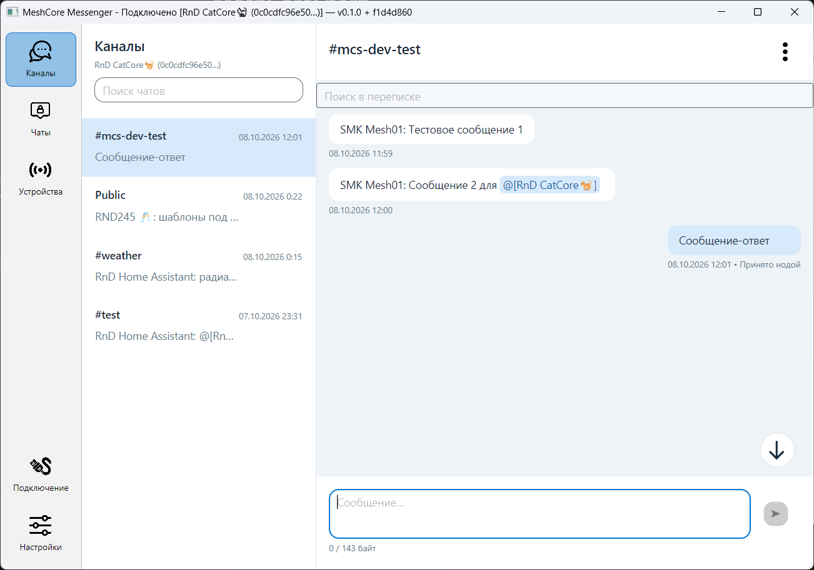

# MeshCore Messenger

Настольный мессенджер для общения через MeshCore Companion-ноду. Позволяет
переписываться в каналах и личных чатах, хранить историю на компьютере и искать
сообщения. Приложение разрабатывается для Windows, macOS и Linux.

> **Ранняя альфа.** Реализован только базовый функционал. В приложении много
> недоделок, ошибок и шероховатостей интерфейса; поведение может меняться между
> версиями. Возможны сбои, потеря данных и проблемы с доставкой сообщений.
> Используйте приложение на свой страх и риск, сохраняйте резервные копии
> и не полагайтесь на него для критически важной связи. Приложение предоставляется
> «как есть», без гарантий. Автор не несёт ответственности за последствия его
> использования.



## Что уже работает

- Подключение к ноде через **USB-UART (Serial)** и **TCP**.
- Отправка и приём текстовых сообщений в настроенных каналах и личных чатах.
- Локальная история, поиск, черновики и счётчики непрочитанных сообщений.
- Статусы отправки, подтверждения доставки личных сообщений и повторы отправки.
- Просмотр информации о контактах и каналах, сброс маршрута личного чата.
- Профили подключения, автоподключение и переподключение после обрыва.
- Светлая и тёмная темы, системный трей и уведомления.

**Bluetooth / BLE пока не поддерживается.** Одновременно приложение работает
с одной подключённой нодой. История разных нод хранится раздельно.

## Перед использованием и ограничения

**Нода должна быть предварительно настроена** и работать с прошивкой MeshCore
Companion, поддерживающей выбранный способ подключения. Подготовьте её другим
совместимым приложением: задайте имя, радиопараметры, каналы и контакты.
Настройки самого приложения есть, но полноценное управление нодой ещё не реализовано.

Сейчас в интерфейсе нельзя:

- Добавлять, изменять и удалять каналы, задавать их ключи.
- Добавлять, редактировать и удалять контакты на ноде.
- Настраивать радио: частоту, мощность, полосу и другие параметры.
- Менять имя и остальные параметры ноды, прошивать устройство.

Ограничений ещё много: это экспериментальный клиент, а не полная замена приложения
для настройки MeshCore. Работа на всех платах, версиях прошивки и вариантах сети
не проверена. Некоторые сценарии и элементы UI ещё требуют доработки.

## Запуск на Windows

1. Скачайте ZIP-архив для своей архитектуры из раздела
   [Releases](https://github.com/DiMoonElec/MeshCoreMessenger/releases): обычно
   `MeshCoreMessenger-win-x64.zip`, для Windows ARM64 — вариант `win-arm64`.
   Если готовой сборки нет, соберите приложение по инструкции ниже.
2. Распакуйте архив.
3. Откройте папку `MeshCoreMessenger` и запустите `MeshCoreMessenger.Desktop.exe`.

Готовая сборка автономная: устанавливать .NET для запуска не нужно.
Для USB-подключения может потребоваться драйвер USB-UART вашей платы.

Версия приложения и короткий git-хэш сборки показаны в заголовке окна.
При сообщении об ошибке указывайте их вместе с версией Windows, моделью ноды,
версией прошивки и шагами воспроизведения.

## Подключение к ноде

1. Откройте раздел **«Подключение»**, нажмите **«Новый профиль»** и задайте название.
2. Выберите способ подключения:
   - **Serial / USB-UART:** выберите COM-порт ноды. Скорость в дополнительных
     параметрах — обычно `115200`.
   - **TCP:** укажите адрес и порт Companion-сервиса ноды.
3. Нажмите **«Сохранить»**, затем **«Подключить»**.
4. Дождитесь статуса **«Подключено»** и загрузки каналов и контактов.
   Выберите переписку в разделе **«Каналы»** или **«Чаты»**.

При желании включите в профиле «Подключаться при запуске» и
«Переподключаться после обрыва». Для отправки текста используйте Enter,
для переноса строки — Shift+Enter. Длина сообщения ограничена протоколом;
приложение показывает доступный объём в байтах.

**DTR/RTS и сброс ноды.** Эти флаги в дополнительных параметрах позволяют
подобрать режим, при котором нода не сбрасывается при открытии порта.
Подходящая комбинация зависит от платы, драйвера и ОС. На проверенном Heltec V3
под Windows для этого нужно снять обе галочки. Если нода сбрасывается и есть
желание разобраться, поэкспериментируйте с комбинациями DTR/RTS.

## Данные и обновление

История, профили и настройки: `%LOCALAPPDATA%\MeshCoreMessenger`.
Для резервной копии закройте приложение и скопируйте всю папку данных.
Для обновления замените сборку; удалять данные не нужно.

## Сборка на Windows

Для сборки нужны **Git** и **.NET SDK 10.0.301** либо совместимое обновление
ветки `10.0.3xx` согласно [global.json](global.json), а также PowerShell 5.1 или 7.
Пакеты NuGet загрузятся при сборке.

Установите Git с [git-scm.com](https://git-scm.com/downloads) и .NET SDK с
[сайта .NET](https://dotnet.microsoft.com/download/dotnet/10.0).
В PowerShell:

```powershell
git clone https://github.com/DiMoonElec/MeshCoreMessenger.git
cd MeshCoreMessenger
powershell -ExecutionPolicy Bypass -File .\tools\publish-windows.ps1
```

По умолчанию собирается `win-x64`. Для Windows ARM64:

```powershell
powershell -ExecutionPolicy Bypass -File .\tools\publish-windows.ps1 -RuntimeIdentifier win-arm64
```

Скрипт создаёт Release-сборку со встроенным .NET и ZIP в
`artifacts/windows/<runtime>/build.<id>/`, затем печатает пути к EXE и архиву.
Сборку и запуск скрипта нужно выполнять на Windows; Windows-скрипт пока ожидает
отдельной проверки на этой платформе.

### Версия сборки

Версия задаётся в [MeshCoreMessenger.Desktop.csproj](src/MeshCoreMessenger.Desktop/MeshCoreMessenger.Desktop.csproj):

```xml
<Version>0.1.0</Version>
```

Git-хэш автоматически записывается при сборке; Git на компьютере клиента
не требуется. При сборке исходников без Git вместо хэша показывается `git unknown`.
Полный хэш хранится в метаданных сборки `AssemblyInformationalVersion`.

## Разработка и документация

Приложение написано на C#/.NET и Avalonia. В репозитории также находится библиотека
`MeshCoreSharp` для работы с Companion-протоколом; приложение использует её
для связи с нодой.

- [Документация проекта](docs/README.md) — навигация по разделам.
- [Текущее состояние](docs/messenger/plan/current-state.md) и
  [план приложения](docs/MESSENGER_PLAN.md).
- [Архитектура мессенджера](docs/MESSENGER_ARCHITECTURE.md).
- [Архитектура библиотеки](docs/ARCHITECTURE.md) и
  [Companion-протокол](docs/COMPANION_PROTOCOL.md).
- [Правила для разработки](AGENTS.md).
