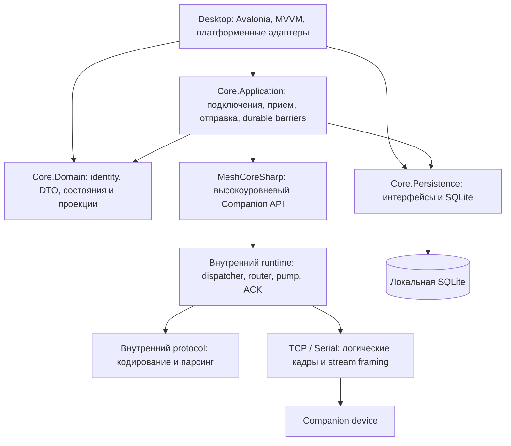

# Архитектурный аудит MeshCoreSharp / MeshCoreMessenger

Дата: **7 октября 2026 года**. Проверенный commit: `5c7b76c`.

**Вывод:** у проекта рабочий архитектурный фундамент и существенная регрессионная база. Переписывать приложение с нуля не нужно. Нужны исправления нескольких механизмов отказоустойчивости и последовательная разгрузка Desktop. Самый серьезный подтвержденный дефект — возможность принять запоздалый ответ на предыдущую команду за ответ на следующую. Самый заметный долг сопровождения — большие ViewModel, связывающие несколько независимых сценариев.

## 1. Область и ограничения проверки

Изучены проекты, актуальные архитектурные контракты, основные цепочки подключения, приема, сохранения, отправки, ACK, обновления UI и завершения работы; реализация крупных классов и связанные тесты. Это архитектурный аудит с выборочной проверкой деталей, а не построчная проверка каждого парсера и каждого представления.

Оценка основана на текущем коде. Старое описание A1 в AGENTS.md не использовалось как фактическое состояние приложения: текущий Messenger уже имеет прием/отправку, историю, черновики, поиск, повторы ЛС и аналитику доставки. Будущие функции из планов не объявляются реализованными.

Проверки:

| Проверка | Результат |
| --- | --- |
| `dotnet build MeshCoreSharp.sln -c Release --no-restore` | Успех, 0 ошибок и 0 предупреждений |
| `dotnet run --project tests/MeshCoreSharp.Tests -c Release --no-build` | 105/105 |
| `dotnet run --project tests/MeshCoreMessenger.Desktop.Tests -c Release --no-build -- -noLogo` | 328/328 |
| Core, полный прогон с разрешенным локальным TCP-эмулятором | 383/384; ошибка в `CancellationInterruptsAnActiveSqliteSearch` |
| Отдельный повтор упавшего теста Core | 1/1 |
| Изолированное воспроизведение запоздалого `OK` через `TestTransport` | Неверное завершение второй команды подтверждено |

Первый прогон Core внутри ограниченной среды дал 74 отказа из-за запрета `TcpListener.Bind`. После запуска с доступом к loopback эти отказы исчезли. Они не считаются дефектами проекта. Оставшийся отказ SQLite описан отдельно ниже. Аппаратные передачи, подключения к реальной ноде и новая ручная GUI-приемка в рамках аудита не проводились. Native-аудиты, которые запускаются отдельно, не следует считать повторенными обычным прогоном Desktop.

Объем исходников production, без `obj`/`bin`, тестов и samples: **269 C#-файлов, 24 503 строки**. Library — 3 851, Core — 11 054, Desktop — 9 598. Размеры включают комментарии, SQL и дополнительные типы внутри файлов; это индикатор концентрации ответственности, а не самостоятельное доказательство плохого дизайна.

## 2. Краткое описание архитектуры

### 2.1. Структура и зависимости

Это слоистый монолит с тремя production-проектами. Вся Companion-библиотека находится в одной `MeshCoreSharp.dll`; Core и Desktop — отдельные потребители. Разделение соответствует требованиям репозитория. Дополнительно есть диагностический Console sample и три тестовых проекта.

- **MeshCoreSharp** отвечает за wire protocol, TCP/Serial, непрерывный RX, сопоставление ответов, single-flight immediate-команды, чтение очереди и ожидание ACK. Runtime и парсеры преимущественно `internal`; приложение использует публичный API. UI и БД в библиотеку не проникли.
- **MeshCoreMessenger.Core** содержит application-сервисы, domain-модели и SQLite-реализацию. Это разделение по папкам внутри одной сборки; компилятор не запрещает Application напрямую зависеть от конкретного SQLite-типа. UI-фреймворка в Core нет. Порты и адаптеры позволяют тестировать сценарии без устройства.
- **MeshCoreMessenger.Desktop** содержит Avalonia Views, ViewModel, платформенные адаптеры, preferences и composition root. `AppBootstrap` собирает DI, включает проверку registrations/scopes. Большинство сервисов имеют lifetime приложения; session/attempt создаются отдельно фабриками. Два retained workspace сохраняют независимый контекст публичных и личных чатов.

### 2.2. Основные потоки

**Подключение.** `ConnectionSupervisor` принимает управляющие сообщения в последовательном control loop, определяет reconnect/suspend/wake policy и владеет активной попыткой. `ConnectionAttempt` объединяет `CompanionSession` и `ReceiveCoordinator`. Session создает отдельный клиент/транспорт, идентифицирует собственную ноду по полному ключу; затем синхронизируются справочники и выполняется initial drain. Отправка допускается после Online.

**Прием.** Stream transport собирает логические кадры из byte stream. RX клиента декодирует пакет и сначала обрабатывает transaction/ACK; публичные callbacks идут через отдельную event queue. Session копирует события в application DTO; `ReceiveCoordinator` — их основной потребитель. Сообщения попадают в `MessageIngestor`, затем в последовательный SQLite writer. После commit UI перечитывает проекции.

**Отправка.** `MessageService` захватывает адресата, текст и session identity. Command lease удерживает workflow в исходной сессии. Prepared/Sending сохраняются до сетевого вызова. Канальная отправка означает прием команды нодой; ЛС имеет отдельное ожидание ACK. `PrivateDeliveryCoordinator` управляет ограниченными очередями и попытками; `OutgoingAttemptWriteTracker` удерживает неудавшиеся локальные записи для retry без повторной передачи в эфир. Автоматические повторы относятся к явно запущенному циклу ЛС, а reconnect не воспроизводит исходящие.

**Хранение.** SQLite WAL, `synchronous=FULL`, один writer thread и короткие read connections. История, отправки и подтверждения связаны с собственной нодой, сессией и устойчивой identity адресата. Канальные slot bindings версионируются. Последовательность истории назначает БД; wire timestamp и время ПК разделены. Есть backup-before-migration и recovery незавершенных отправок.

**Закрытие.** Останавливается admission и фоновая работа, завершается RX, ожидаются owned workflows; библиотечный event barrier отделен от application ingest и durable write barriers. При ошибке сохранения штатное закрытие остается повторяемым. Это сильная часть архитектуры, хотя расширение списка writers пока требует ручного изменения нескольких мест.

### 2.3. Что сделано хорошо

1. Протокольные ответы не сопоставляются просто по принципу «следующий пакет». Push и ACK проходят независимо от обычных команд; subscribe-before-send реализован.
2. Транспортный framing отделен от logical frames; TCP/Serial используют общий codec. Новый BLE не требует переноса framing в верхние слои.
3. Identity истории основана на полном ключе собственной ноды и адресата, а не на endpoint или имени. Коллизии префиксов и неизвестные каналы не скрываются догадками.
4. Сессии, поколения, command leases и CAS-переходы предотвращают большой класс ошибок при reconnect и late ACK.
5. Commit-before-UI, barriers и retry только локальных записей защищают историю и честность статусов.
6. История подгружается страницами; основное окно сообщений ограничено 500 элементами. Есть fake clients, эмуляция TCP и значительная тестовая база.

Эти решения следует сохранить. Большая часть сложности Core обусловлена реальными ограничениями Companion-протокола и требованиями сохранности.

## 3. Проблемы архитектуры

Приоритеты: **P1** — исправить ближайшим циклом до дальнейшего расширения затрагиваемого механизма; **P2** — плановый рефакторинг перед связанными фичами; **P3** — улучшение по измеренной необходимости. «Подтверждено» означает наличие факта в коде или эксперименте; «риск» — дефект возможного использования/расширения, без доказанного пользовательского инцидента.

### R1. После неопределенного исхода команды не защищено владение ответом — P1, подтверждено экспериментом

Источники: [CommandDispatcher.cs](../src/MeshCoreSharp/Runtime/CommandDispatcher.cs), [SinglePacketTransaction.cs](../src/MeshCoreSharp/Runtime/Transactions/SinglePacketTransaction.cs), [PacketRouter.cs](../src/MeshCoreSharp/Runtime/PacketRouter.cs).

При timeout/cancellation transaction снимается и command gate освобождается. Новая команда может начать ждать пакет того же типа. В `OK` и `ERROR` нет correlation ID; такой пакет от первой команды завершит вторую. Подобная проблема возможна и у типизированных ответов, если их дополнительные поля не различают запросы.

Проверенный сценарий: первая `SetDeviceTimeAsync` истекла без ответа; запущена вторая с другим временем; после ее TX подан единственный `OK`, представляющий задержанный ответ первой. **Вторая завершилась успешно без собственного ответа.** Experiment использовал fake transport, без сетевого устройства. Существующий `TimeoutRecovery` проверяет дальнейшую работоспособность команд разных типов и не закрывает этот случай.

Это неправильное владение ответом, способное дать ложный успех отправке или изменению конфигурации. Application-level защита от timeout drain уже существует, но общей проблемы всех команд не решает.

**Предложение:** после отправленного запроса с неопределенным immediate-исходом переводить command session в явно непригодное для новых команд состояние до проверенной ресинхронизации. Самый консервативный вариант — закрыть admission и потребовать нового соединения/handshake; проверить, что для конкретного транспорта/firmware это отделяет старые ответы. Автоматически повторять исходную mutation нельзя. Фиксированная задержка и «пропустить один OK» надежной корреляции не создают. Отдельно различать отмену до TX и после возможного TX. Добавить регрессии same-type late OK/ERROR, отмены после TX и контактов после незавершенного stream. Это осознанное изменение timeout-контракта, требующее обновления существующих recovery-тестов.

### R2. Сигнал перегрузки приема не подключен к управлению — P1, подтверждено кодом

Источники: [MessageIngestor.cs](../src/MeshCoreMessenger.Core/Application/MessageIngestor.cs), [ReceiveCoordinator.cs](../src/MeshCoreMessenger.Core/Application/ReceiveCoordinator.cs), [CompanionSession.cs](../src/MeshCoreMessenger.Core/Application/CompanionSession.cs), [ClientEventQueue.cs](../src/MeshCoreSharp/Runtime/ClientEventQueue.cs), [storage contract](messenger/architecture/storage.md).

`IsOverloaded` вычисляет пороги 1000 сообщений / 16 MiB. Поиск использования показывает, что production-код этот флаг не читает. Документ обещает остановку приема supervisor-ом при перегрузке; фактически такой реакции нет.

Неограничены transport frame queues, библиотечные callbacks, application session events, ingress и database writer queue. Session также копирует raw packet для нескольких разновидностей уведомлений; часть этих событий consumer просто игнорирует. При медленном диске/обработчике и достаточно большом backlog память может расти. Наличие лимита viewport не ограничивает эти очереди.

**Предложение:** первым шагом подключить overload-сигнал к receive/supervisor, остановить новый drain и admission, сохранить уже принятые события и показать NeedsAttention. Метрики должны учитывать длину/байты и возраст очередей. Диагностику вынести в отдельный bounded ring buffer со счетчиком пропусков. Для более строгой защиты потребуется отдельный приемный sink, позволяющий ограничивать чтение сообщений ноды с учетом persistence. Нельзя просто поставить bounded `Channel` с ожидающим `WriteAsync` в общий RX: так можно заблокировать прием ответа, нужного текущей команде. Нельзя терять пользовательские сообщения через DropOldest/DropWrite. Проверить медленный store и backlog сверх порога.

### R3. Исключительное владение event stream не закреплено API — P1 перед подключением нового потребителя, подтвержденный риск

Источники: [CompanionSession.cs](../src/MeshCoreMessenger.Core/Application/CompanionSession.cs), [CompanionSessionModels.cs](../src/MeshCoreMessenger.Core/Domain/CompanionSessionModels.cs).

Документ требует единственного application event consumer. Однако `Events` — публичный `ChannelReader`, а channel допускает нескольких readers. Если будущий PacketMonitor или новая фича начнет читать его параллельно, readers разделят события между собой: это не broadcast. Могут пропасть сообщения из ingest либо barrier marker, на котором ждет initial drain. Сейчас основной путь имеет одного reader; фактическую потерю от второго reader аудит не наблюдал.

**Предложение:** скрыть reader и acquisition consumer внутри application implementation, выдавать право чтения только один раз и проверять это. `SingleReader=true` само по себе не запрещает второго читателя. Для diagnostics/UI использовать отдельные подписки или поток post-commit invalidations, сохраняя собственные правила буфера. Аналогично ограничить публичность session lifecycle до необходимого интерфейса.

### R4. Отказ event pump недостаточно наблюдаем владельцем — P1, риск зависшего барьера

Источник: [ReceiveCoordinator.cs](../src/MeshCoreMessenger.Core/Application/ReceiveCoordinator.cs), методы `PumpEventsAsync`, `RunAsync`, `DrainOnePassAsync`.

`PumpEventsAsync` перехватывает нормальную отмену, но неожиданный fault не публикует в `_failure`/`_initial`. Начальный drain ожидает marker, который должен обработать именно этот pump. Если pump умер раньше, worker может ждать до внешней отмены. `ConnectionAttempt` наблюдает coordinator.Failure, но не получает такой fault сразу. В действующем наборе DTO путь редкий; появление нового ReceivedMessage или отказ другого обработчика делает его более вероятным.

**Предложение:** объединить принадлежащие coordinator задачи в наблюдаемый lifecycle: отказ любого обязательного worker публикует первичную причину, закрывает admission и разблокирует его pending barriers ошибкой. Отделить отказ необязательного route enrichment от отказа приема. Ввести тест с fault consumer до event marker и проверить конечность Start/Stop. Не лечить это только дополнительным timeout.

### R5. Отмена SQLite имеет незакрытую гонку запуска и нестабильный тест — P2, результат проверки подтвержден

Источники: [DatabaseReader.cs](../src/MeshCoreMessenger.Core/Persistence/Sqlite/DatabaseReader.cs), [HistoryPagingTests.cs](../tests/MeshCoreMessenger.Core.Tests/HistoryPagingTests.cs), тест `CancellationInterruptsAnActiveSqliteSearch`.

Полный прогон дал `No exception was thrown`, отдельный повтор прошел. Тест подает `started` **до** `ExecuteScalar`, поэтому не гарантирует, что SQL уже выполняется при `Cancel`. `DatabaseReader` проверяет token перед открытием connection и регистрирует одноразовый `sqlite3_interrupt`; внутри произвольного action нет общего гарантированного контроля отмены при запуске последующих SQL-команд. Interrupt до старта операции может не остановить будущую команду.

Это подтвержденная нестабильность проверки и потенциальный пробел responsiveness, а не доказательство повреждения БД или постоянной неисправности всех read cancellation.

**Предложение:** определить точную семантику отмены read operation, убрать произвольный action из cancellation-sensitive пути в пользу помощника запуска команд с token; проверить отмену до SQL, во время SQL и между несколькими SQL. Если требуется гарантированное прерывание после гонки запуска, изучить SQLite progress callback с проверкой token. Делать тест детерминированным через подтвержденный старт исполнения, а не только TCS перед вызовом. Повторять full-suite и targeted test до устранения причины, не считать одиночный повтор доказательством исправления.

### R6. TCP не имеет столь же ясной модели write/connection ownership, как Serial — P2, подтверждено кодом; последствия требуют focused tests

Источник: [TcpMeshCoreTransport.cs](../src/MeshCoreSharp/Transport/Tcp/TcpMeshCoreTransport.cs), сравнение с [SerialMeshCoreTransport.cs](../src/MeshCoreSharp/Transport/Serial/SerialMeshCoreTransport.cs).

1. В `ConnectAsync` локальный `TcpClient` освобождается только в catch, исключающем `OperationCanceledException`. Отмена connect оставляет владение ресурсом сборщику мусора вместо детерминированного cleanup.
2. `SendAsync` захватывает `_stream` до ожидания write gate. Cleanup не координируется с завершением всех sends; dispose освобождает gate, пока send потенциально еще выполняется.
3. Отмена/ошибка TCP-write не приводит здесь к явному закрытию поврежденной framing session. Если запись оборвалась после части frame, следующие bytes могут продолжить незавершенный frame. Serial уже явно обрабатывает uncertainty и использует отдельный session owner.

**Предложение:** дать TCP отдельный connection/session owner с captured stream, stop token, write gate и owned in-flight writes. При возможной частичной записи закрывать данную session; не передавать следующую команду в потенциально поврежденный поток. Гарантировать dispose локального client при отмене connect. Проверить отмену blocked connect, write/disconnect/dispose race и partial write. Переиспользовать frame codec; большой универсальный transport base class пока не нужен.

### R7. Desktop state не везде остается на UI-потоке — P2, подтвержденные пути; native-эффект не воспроизводился

Источники: [MainWindowViewModel.cs](../src/MeshCoreMessenger.Desktop/ViewModels/MainWindowViewModel.cs), [ChatWorkspacesViewModel.cs](../src/MeshCoreMessenger.Desktop/ViewModels/ChatWorkspacesViewModel.cs).

Callbacks commit выполняются вне UI, но `OnMessageCommitted`/`OnContactRouteCommitted` читают `ViewedNode` непосредственно. `RefreshAsync` workspaces после асинхронного чтения вызывает `ReportVisibleRange` без обязательного dispatcher. В `MainWindowViewModel.StopAsync` после ожидания composer contexts с `ConfigureAwait(false)` вызывается `Chats.StopAsync`, который изменяет observable visibility и viewport state. Фактический поток зависит от того, завершилось ли предыдущее await синхронно; единый контракт отсутствует.

**Предложение:** в callbacks только копировать/очередить DTO; проверять актуальный UI context при применении через dispatcher. Все observable mutations, включая Stop/Refresh, выполнять на UI thread. Добавить `CheckAccess`/assertion адаптера и тест с реально асинхронным completion, чтобы synchronous test doubles не скрывали проблему. Удобный владелец — небольшой immutable workspace context + revision, а не набор независимо читаемых ViewModel-properties.

### R8. MainWindowViewModel стал вторым composition root и центром интеграции — P2

Источник: [MainWindowViewModel.cs](../src/MeshCoreMessenger.Desktop/ViewModels/MainWindowViewModel.cs): 1005 строк, 23 constructor parameters.

В одном классе находятся startup, node selection, connection presentation, создание дочерних owners, wiring composer/repeats/resends, modal cards, history-clear integration, commit queues, projection refresh worker, preferences и shutdown. Новая связанная фича обычно добавляет dependency, callback и еще одну часть teardown в этот класс. DI существует, но значительное создание object graph остается ручным в ViewModel.

**Предложение:** выделить `NodeContextCoordinator`, `CommittedProjectionUpdater` и `ChatWorkspaceFactory`; dialogs открывать через небольшой coordinator. MainWindow оставить shell-level owner: подготовленные child VMs, команды окна, aggregate status и lifecycle delegation. Фабрика workspace должна возвращать объект с явным Stop/Dispose, включающий navigation, composer и feature coordinators. Не требуется регистрировать каждую мелкую ViewModel в DI. Optional production dependencies перевести в отдельную фабрику тестовых fixtures или явный capabilities contract.

### R9. Navigation и HistoryWindow совмещают несколько независимых моделей состояния — P2

Источники: [ConversationNavigationViewModel.cs](../src/MeshCoreMessenger.Desktop/ViewModels/ConversationNavigationViewModel.cs), [HistoryWindowViewModel.cs](../src/MeshCoreMessenger.Desktop/ViewModels/HistoryWindowViewModel.cs).

Navigation-файл: 1310 строк, собственно owner примерно до строки 1090; ниже размещены list item types. Он совмещает directory pages, selection persistence, tab/filter/layout state, details, search, draft/history coordination и cancellation/revision tracking. HistoryWindow: 1211 строк; paging, viewport, unread advancement, search, highlight, commits и lifecycle. Это разные причины изменения, связанные большим количеством полей и version checks.

Дополнительно `_handledCommitIds` растет в пределах открытого conversation и очищается при смене/инвалидации контекста. Ограничение 500 сообщений не ограничивает этот набор в долгоживущем чате. Это не мгновенная большая утечка, но bounded viewport заявлен шире, чем обеспечено его вспомогательным состоянием.

**Предложение:** Navigation оставить orchestration selection/history/draft, выделить directory paging/search owner и selection persistence. History разделить на history-window loader, search owner и read-progress tracker. Viewport policy должна иметь одного владельца и небольшой набор явных переходов. Перенести list item types в отдельные файлы; это улучшит навигацию, но само по себе не уменьшит связность. Дедупликацию UI invalidations ограничить коротким окном/epoch либо использовать sequence watermark там, где порядок гарантирован. Новые owner objects обязаны сохранять context fencing и lifecycle await.

### R10. Обновление UI слишком широко инвалидирует read projections — P2/P3 по нагрузке

Источник: [MainWindowViewModel.cs](../src/MeshCoreMessenger.Desktop/ViewModels/MainWindowViewModel.cs), `RefreshCommittedProjectionAsync`.

Любой запрос refresh сначала перечитывает оба chat workspace и Devices; затем отдельно применяет все pending message/outgoing commits. Outgoing status одного ЛС может инициировать несвязанные directory/device reads. Сигнал coalesced, но список payloads не coalesced. Чем больше статусов/фич, тем больше read amplification и нагрузки на UI/SQLite.

**Предложение:** единый typed post-commit invalidation с NodeId, ConversationId, MessageId и видом изменения. Coalesce status invalidations по MessageId; directory/device refresh делать только при изменении соответствующих данных. Для incoming сохранить порядок sequence и семантику unread. Измерить SQL count и latency пачки updates до/после; не добавлять сложный cache без данных о необходимости.

### R11. Общий command lease смешивает lifecycle capability и всю feature surface — P2 перед новыми mutation/remote-фичами

Источники: [SessionCommandGateway.cs](../src/MeshCoreMessenger.Core/Application/SessionCommandGateway.cs), [SessionCommandLease.cs](../src/MeshCoreMessenger.Core/Application/SessionCommandLease.cs), [IMeshCoreClientFactory.cs](../src/MeshCoreMessenger.Core/Application/IMeshCoreClientFactory.cs).

Lease хорошо удерживает owned workflow, но содержит sending, status persistence, ACK, contact/channel mutation, advertisement и directory reads. Проверка неподходящего target идет runtime-условиями. Многие adapter/store methods имеют default `NotSupportedException`, поэтому добавление метода не заставляет реализации явно поддержать его. Application lease напрямую распознает `SqliteException`.

Публичные low-level mutations lease не реализуют сами application-контракт drain → barriers → mutation → readback → commit binding. Это пока преимущественно заготовка под будущие фичи; текущий `ContactRouteService` реализует свой owned сценарий. Подключать новую кнопку прямо к `SetChannelAsync` недостаточно.

**Предложение:** сохранить один механизм ownership/admission внутри session scope, поверх него дать маленькие feature interfaces/typed capabilities. Feature-сервисы должны владеть whole workflow; изменение канала обязано пройти через единственного receive/binding owner. Ошибки storage переводить в application exception на persistence boundary. Обязательные production interfaces не должны молча оставлять операцию неподдержанной; частичные fake adapters оформлять явно. Новые remote requests требуют отдельной firmware request gate, не удержания immediate command gate на весь radio wait.

### R12. Политики отправки и persistence contracts расширяются накоплением веток — P2

Источники: [MessageService.cs](../src/MeshCoreMessenger.Core/Application/MessageService.cs), [IOutgoingMessageStore.cs](../src/MeshCoreMessenger.Core/Persistence/IOutgoingMessageStore.cs), [SqliteOutgoingMessageStore.cs](../src/MeshCoreMessenger.Core/Persistence/Sqlite/SqliteOutgoingMessageStore.cs) и его partial-файлы.

MessageService одновременно реализует channel/private, resend/repeat, processing/draft transfer и два режима private execution в зависимости от optional `PrivateDeliveryCoordinator`. Singleton `_singleFlight` отклоняет параллельный admission; channel держит его до immediate результата, хотя private admission и channel workflow имеют разные сроки. Это допустимая текущая policy, но скрытая в общем сервисе.

Outgoing store — **один класс на 835 строк в четырех partial-файлах**, а не четыре независимых сервиса. Он объединяет preparation, attempts, cycles, timestamp floors, ACK matching, route enrichment, recovery и reads. Partial-разделение помогает читать, но не сокращает contract surface.

**Предложение:** отдельные `ChannelSendService` и `PrivateSendAdmissionService`, общие helpers durable preparation/draft transfer; IMessageService может остаться фасадом. Production coordinator сделать обязательным либо выбрать явную policy implementation. Разделить read contract, attempt writer и private delivery writer; внутренние SQL-компоненты пусть принимают один connection/transaction из facade, чтобы общий ACK commit оставался атомарным. Не разбивать одну транзакцию по самостоятельным repositories с отдельными commits. Очередь admission и ограничения concurrent sends сделать явной policy и проверить interleaved channel/private scenarios.

### R13. Identity DTO допускают некорректные комбинации и mutable ownership — P2, риск расширения

Источники: [OutgoingMessageModels.cs](../src/MeshCoreMessenger.Core/Domain/OutgoingMessageModels.cs), [StorageRecords.cs](../src/MeshCoreMessenger.Core/Domain/StorageRecords.cs), [DraftModels.cs](../src/MeshCoreMessenger.Core/Domain/DraftModels.cs).

`OutgoingRecipient(Kind, Identity, BindingId?, Slot?, Generation?)` позволяет channel без binding и contact с лишними channel fields. Во многих DTO разные identities представлены одинаковыми `Guid`/`byte[]`. `record` не делает `byte[]` неизменяемым; `ReadOnlyMemory<byte>` запрещает запись через этот view, но не через исходный массив. Копирование на admission часто уже сделано правильно, однако инвариант распределен по множеству `.ToArray()`, length checks и switch.

**Предложение:** validated value types полного public key, channel fingerprint и binding capture, с копированием при создании и value equality; разные recipient variants для contact/channel. Вводить сначала в admission и persistence boundaries, не менять сразу все DTO. Проверки identity/session ownership в SQL оставить: value type не защищает от устаревшей session или binding.

### R14. Restore имеет только storage-barrier, но требует application-wide maintenance ownership — P2 до появления UI восстановления

Источник: [LocalStorage.cs](../src/MeshCoreMessenger.Core/Persistence/LocalStorage.cs), `RestoreAsync`; [storage contract](messenger/architecture/storage.md).

Восстановление проверяет staging database и выполняет backup в active writer connection, но API не запрещает активную session и не координирует draft/read/outgoing trackers и UI cache. Одна writer queue дает порядок SQL, но не делает старые in-memory NodeId/SessionId/messages действительными после замены БД. Документ требует stopped session. В действующем UI этот сценарий аудитором не найден; это риск публичного maintenance API.

**Предложение:** application `StorageMaintenanceService` закрывает admission, завершает session и writers, восстанавливает snapshot, затем пересоздает storage-dependent owners или перезапускает приложение. Low-level restore документировать как требующий quiescence и, по возможности, проверять maintenance token. Backup может выполняться отдельно без такого полного teardown. Не превращать LocalStorage в владельца reconnect/UI.

## 4. Расширяемость и стоимость новых функций

Архитектура хорошо расширяется там, где изменение остается в одном существующем механизме. Стоимость резко растет, если функция одновременно затрагивает session lifetime, durable writes и Desktop state.

| Новая функция | Относительная сложность | Что поможет / что мешает |
| --- | --- | --- |
| Новая простая Companion-команда или packet parser | Низкая–средняя | Есть encoder/parser/dispatcher. Нужно корректное matching, malformed/raw handling и тесты; MeshCoreClient постепенно увеличивается |
| BLE transport | Средняя | Контракт logical frames подходит. Нужны отдельные platform adapters, MTU/lifecycle и device tests; reconnect остается policy приложения |
| Новый экран, карточка или оформление сообщения | Низкая–средняя | Есть shell/cards/projections. Wiring в MainWindow и общие list-item types увеличивают область правки |
| Export истории, read-only статистика/аналитика | Средняя | Node-scoped readers и paging подходят. Для больших export нужен streaming read; не загружать все в observable collection |
| Создание/удаление контакта, смена/очистка канала | Высокая | Библиотечные методы есть, но application mutation workflow, readback, binding transitions и recovery обязательны; R1/R11 критичны |
| Новый алгоритм повторов ЛС | Средняя–высокая | Есть RetryPlan/cycles/attempt snapshots. MessageService/lease/store связаны широкими контрактами; важно не смешать message, attempt и wire identity |
| Remote status/telemetry/login | Высокая | Immediate/deferred архитектура пригодна, но firmware single-flight требует отдельного owner/gate и terminal matcher |
| PacketMonitor/debug RX | Средняя | Raw packets доступны. Нужен собственный bounded diagnostic stream; нельзя читать session channel вторым consumer |
| Миллионы сообщений, интенсивный backlog | Высокая | Paging и WAL — хороший старт. R2/R10, число read connections и scan-search станут ограничениями |
| Несколько одновременно активных нод/окон | Очень высокая | Supervisor, gateway, delivery admission и многие VMs имеют application-singleton семантику. Нужен явный node/session workspace scope, а не еще один singleton client |
| Второй UI, headless service или CLI на Core | Средняя | Core свободен от Avalonia. Нужно выделить стабильный application composition/lifecycle, чтобы не копировать desktop wiring |

Поиск через параметризованный `instr(Text, $query)` — осознанное решение для literal substring. Индексы node/conversation ограничивают область, но сам substring требует сканирования. **FTS сейчас не обязательный рефакторинг:** сначала измерить сценарии на целевом объеме; token-based FTS меняет поисковую семантику, и не является прозрачной заменой `instr`.

Добавление новой durable feature сейчас требует помнить регистрации, admission/quiesce, Flush/Retry и shutdown ordering. Предлагается небольшой реестр durable participants с явным порядком фаз и диагностикой pending/failure. Он должен объединять lifecycle contract, а не заставлять разные модели retry использовать одну универсальную очередь.

## 5. Конкретные классы и файлы для рефакторинга

| Файл / класс | Предлагаемый результат | Приоритет и критерий готовности |
| --- | --- | --- |
| `MeshCoreSharp/Runtime/CommandDispatcher.cs`, `PacketRouter.cs`, `Transactions/SinglePacketTransaction.cs` | Явная invalid/uncertain command session после неопределенного TX; запрет нового matching до resync | P1: late same-type ответ не завершает новый запрос; отмена до TX не портит session |
| `Core/Application/MessageIngestor.cs`, `ReceiveCoordinator.cs`, `ConnectionSupervisor.cs` | Реальная overload reaction и метрики backlog | P1: медленный store прекращает новый drain, accepted messages удерживаются |
| `Core/Application/CompanionSession.cs`, `Domain/CompanionSessionModels.cs` | Закрытый единственный consumer, отдельная bounded diagnostics subscription | P1 перед monitor: второй consumer нельзя получить; barriers не теряются |
| `Core/Application/ReceiveCoordinator.cs` — 506 строк | Разделить receive event consumer, drain scheduler и binding transition owner; общий task supervision | P1 fault handling / P2 decomposition: отказ pump завершает Start/Stop, старые messages сохраняются |
| `Desktop/ViewModels/MainWindowViewModel.cs` — 1005 строк | Workspace factory + node context + projection updater + dialog coordinator | P2: новая карточка/commit handler не требует расширения 23-argument constructor |
| `Desktop/ViewModels/ConversationNavigationViewModel.cs` — 1310 строк файла | Directory/search owner, selection persistence; list-item types отдельно | P2: selection, paging, search можно менять и тестировать независимо |
| `Desktop/ViewModels/HistoryWindowViewModel.cs` — 1211 строк | Loader/window state + search + read-progress owners; ограниченная дедупликация invalidations | P2: сохранены bounded window, anchors, unread и context fencing |
| `Desktop/ViewModels/ChatWorkspacesViewModel.cs`, `Lifecycle/DesktopUiServices.cs` | Явная UI-thread affinity для refresh/stop/context updates | P2: delayed-async tests не создают observable notifications вне UI |
| `Core/Application/ConnectionSupervisor.cs` — 950 строк | Сохранить один loop; выделить transition/retry policy и attempt task runner | P2: transitions тестируются таблицей; ни один helper не становится вторым owner session |
| `Core/Application/SessionCommandLease.cs` — 348 строк; `SessionCommandGateway.cs` — 198 | Разделить общий task ownership и typed feature capabilities, убрать SQLite exception из application механизма | P2: wrong-target операции нельзя выбрать или они отклоняются до side effect |
| `Core/Application/MessageService.cs` — 337 строк; `PrivateDeliveryCoordinator.cs` — 245 | Явные channel/private admission services; delivery loop разбить на prepare/send/wait/reset steps | P2: новая retry policy не добавляет ветви общего send method |
| `Core/Persistence/Sqlite/SqliteOutgoingMessageStore.cs` + private delivery/ACK/learned-route partials — 835 строк | Малые SQL-компоненты за facade с общим transaction context; read/write interfaces отдельно | P2: ACK evidence/cycle/status остаются одним атомарным commit |
| `Core/Persistence/Sqlite/SqliteDirectoryStore.cs` — 631 строк | Внутренние contact/channel/binding SQL helpers и общий snapshot transaction | P2: расширение contact fields не меняет binding transition machinery |
| `Core/Persistence/Sqlite/DatabaseReader.cs`; `tests/.../HistoryPagingTests.cs` | Cancellable command execution и детерминированный тест старта SQL | P2: отмена на разных фазах проверяется воспроизводимо |
| `MeshCoreSharp/Transport/Tcp/TcpMeshCoreTransport.cs` — 242 строки | TCP session owner и согласованный cleanup/write lifetime | P2: cancelled connect и concurrent write/stop/dispose освобождают ресурсы |
| `Core/Domain/StorageRecords.cs`, `OutgoingMessageModels.cs`, `DraftModels.cs` | Validated identities и разные recipient variants | P2 постепенно: невалидную комбинацию не удается создать через public constructor |
| `Core/Persistence/LocalStorage.cs`; `Desktop/Lifecycle/DesktopShutdownCoordinator.cs` | Maintenance workflow и реестр durable lifecycle participants | P2 до restore/new writers: весь graph quiesced, old IDs не используются после restore |
| `MeshCoreSharp/Client/MeshCoreClient.cs` — 679 строк | Внутренние operation helpers по семействам, сохранить небольшой public facade | P3 по мере роста: добавление команды не затрагивает RX/lifecycle |
| `Core/Persistence/Sqlite/DatabaseMigrator.cs` — 439 строк | Новые миграции оформлять отдельными immutable steps/resources | P3: сохранены old DB fixtures и backup-before-migration; старые миграции не переписываются |

`PrivateDeliveryCoordinator` и `SessionCommandLease` меньше крупнейших VMs, но плотнее по ответственности и состояниям: размер не должен быть единственным критерием. В свою очередь, `LocalStorage` как aggregate owner stores и короткие parser-классы сами по себе не требуют дробления.

## 6. Порядок работ и сохранение поведения

1. **Закрыть R1–R4.** Сначала ownership ответов, overload reaction, единственный consumer и наблюдаемость fault обязательных workers. Исправления делать небольшими изменениями с focused regressions. Согласовать обновленный timeout contract с текущими тестами.
2. **Закрепить жизненный цикл и потоки.** TCP session ownership, SQLite cancellation, UI affinity. Добавить проверки с настоящим delayed completion и concurrency, не только синхронные fake implementations.
3. **Разгрузить Desktop до крупных новых экранов.** Сначала projection updater и workspace factory, затем search/read/selection owners. Сохранять текущие public/private retained workspaces и тесты anchors/drafts/unread.
4. **Перед mutation/remote-фичами разгрузить application contracts.** Feature-specific capabilities поверх общего session ownership, обязательные interfaces и mutation barriers. Существующие SQL ownership checks и атомарные commits сохранить.
5. **Оптимизировать по измерениям.** Targeted invalidations, scan-search, read connection load, batching и диагностика queue latency. Не выполнять массовую перестройку persistence ради размера файлов.

Нужные регрессии: late OK/ERROR after timeout/cancel; fault consumer before marker; overload with slow store; delayed dispatcher in stop/refresh; TCP write/dispose race; cancellation before/during/between SQL commands; channel mutation during backlog; добавление diagnostic subscriber без кражи message/barrier.

Запретить случайные нарушения границ можно небольшими architecture checks: Core не ссылается на Avalonia/Desktop; библиотека не ссылается на Core/SQLite; Desktop не использует internal protocol/runtime; production registration не допускает частично поддержанного обязательного adapter. Для этих checks не нужны новые production-проекты.

При рефакторинге нельзя убирать сериализацию immediate-команд, subscribe-before-send, независимый RX/ACK, commit-before-UI, version fencing, barriers и запрет replay после reconnect. Нельзя заменять uncertainty исходящей передачи вымышленным Failed/Delivered. Сначала выделять объект с прежним поведением, затем отдельно менять policy: иначе трудно понять причину регрессии.

## 7. Итоговая оценка масштаба проблемы

**Масштаб «бедствия»: примерно 4/10**, где 0 — почти нет архитектурного долга, 10 — сопровождение практически невозможно. Это качественная оценка, не рассчитанная метрика.

Библиотека компактна и имеет хорошие границы. Core сложен, но его основная сложность оправдана session ownership, неоднозначностью протокола и сохранностью данных. Desktop уже достиг размера, при котором очередная фича в больших VMs повышает стоимость тестирования и риск побочного эффекта. Четыре самых больших файла содержат около 18% production C#-строк; три крупнейших Desktop-файла — около 37% Desktop C#-строк.

**Срочно нужен небольшой набор исправлений корректности, а не полная смена архитектуры.** R1 подтвержден экспериментом; R2 противоречит заявленному contract. Эти задачи стоит поставить выше новых команд изменения конфигурации и высоконагруженных сценариев. R3/R4 лучше закрыть до подключения новых event consumers.

**Плановый рефакторинг нужен сейчас.** Его разумно проводить рядом со следующими затрагивающими компонент фичами, начиная с MainWindow, Navigation и HistoryWindow. Не нужно прекращать всю разработку на неопределенный срок: независимые небольшие UI/read-only улучшения возможны, если они не увеличивают найденные узкие места.

**Перестройка в много проектов, микросервисы или тотальная перепись не оправдана.** Она не устранит отсутствие correlation ID, firmware single-flight и необходимость durable barriers, зато потребует заново проверить уже работающие сценарии. Сохранить три production-проекта и одну Companion assembly; улучшать локальные boundaries, capability types и владельцев состояния.

Пересматривать верхнеуровневую модель имеет смысл при реальном переходе к нескольким одновременно активным нодам/окнам, shared network storage или существенно другой delivery policy. Для текущего локального messenger с одной активной нодой архитектура пригодна. Ее надо укрепить и разгрузить, а не выбрасывать.
