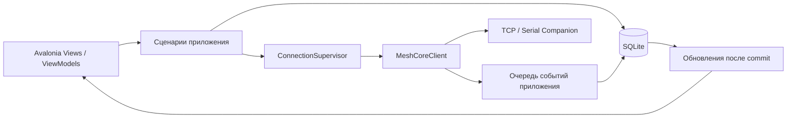

# Архитектура настольного мессенджера MeshCore

Актуализация: 28.09.2026. Статус: **этапы A/B реализованы, включая разделение
transport profile и node identity в B7.5; Stage C разбит на подэтапы, ещё не реализован**.
Рабочее имя: `MeshCoreMessenger`. Документ задаёт решения для ИИ-агентов;
порядок работ и критерии готовности — [MESSENGER_PLAN.md](MESSENGER_PLAN.md).
Фактические возможности библиотеки — [PLAN.md](../PLAN.md).

## 1. Цель и границы первой версии

Локальное настольное приложение для повседневной текстовой переписки через
MeshCore Companion. Основные платформы — macOS и Windows; Linux сохраняем
совместимым по архитектуре, но не включаем в обязательную аппаратную приёмку.
Радиопараметры и имя ноды пользователь предварительно настраивает вне приложения.

Обязательный пользовательский сценарий:

1. Сохранить профиль TCP/IP или Serial, выбрать автоподключение.
2. Открыть приложение и сразу увидеть локальную историю; подключение идёт в фоне.
3. Читать и писать личные сообщения и сообщения каналов, видеть состояние отправки.
4. Закрыть приложение, снова открыть и продолжить работу с историей и черновиками.
5. После потери связи дождаться восстановления или остановить повторные попытки.
6. Управлять Chat-контактами и каналами; просматривать/удалять служебные контакты отдельно.

Один процесс, одна локальная БД и **одна активная нода одновременно**. Профилей
может быть несколько; история каждой ноды сохраняется отдельно. Облачных сервисов,
учётных записей, синхронизации нескольких компьютеров и фонового системного демона нет.

## 2. Технологии и структура решения

- `.NET 10`, как у существующей библиотеки.
- Avalonia Desktop + XAML, MVVM, `CommunityToolkit.Mvvm`.
- Базовая тема Fluent, собственные стили списков и сообщений, системная/светлая/тёмная тема.
- `Microsoft.Data.Sqlite`, параметризованный SQL, явные SQL-миграции.
- `Microsoft.Extensions.DependencyInjection` и `ILogger` в приложении.
- Без EF Core, ReactiveUI, MediatR и сервера в первой версии: требуемых механизмов немного.
- Версии NuGet фиксировать при первом этапе после проверки совместимости с `net10.0`;
  использовать стабильные версии и lock-файл, не плавающие диапазоны.

Подэтап A1 зафиксировал SDK `10.0.301` и следующие прямые зависимости:

| Назначение | Пакет | Версия |
| --- | --- | --- |
| Desktop UI | `Avalonia`, `Avalonia.Desktop`, `Avalonia.Themes.Fluent` | `12.1.3` |
| MVVM | `CommunityToolkit.Mvvm` | `8.4.2` |
| Будущее SQLite-хранилище Core | `Microsoft.Data.Sqlite` | `10.0.12` |
| Bootstrap | `Microsoft.Extensions.DependencyInjection`, `Microsoft.Extensions.Logging.Console` | `10.0.12` |
| Новые тесты | `xunit.v3` с Microsoft Testing Platform | `4.0.1` |

Версии централизованы в `Directory.Packages.props`; `Directory.Build.props`
включает NuGet lock-файлы, а CI должен восстанавливать их в locked mode.

Avalonia имеет desktop-поддержку Windows/macOS/Linux; минимальные версии ОС
зависят от выбранного релиза, поэтому матрицу пакетов и ОС нужно зафиксировать
при создании приложения. [Официальная матрица](https://docs.avaloniaui.net/docs/supported-platforms).
MVVM Toolkit не привязан к конкретному UI-фреймворку.
[Документация](https://learn.microsoft.com/en-us/dotnet/communitytoolkit/mvvm/).

```text
src/MeshCoreSharp/                  существующая единственная Companion-библиотека
src/MeshCoreMessenger.Core/         сценарии приложения и SQLite, без Avalonia
  Domain/                          идентичность, модели истории, статусы
  Application/                     сессия, сообщения, справочники, настройки
  Persistence/                     SQL, миграции, репозитории, резервные копии
  Integration/                     адаптер публичного MeshCoreClient
src/MeshCoreMessenger.Desktop/      Avalonia executable
  Views/ ViewModels/ Styles/ Assets/
  Platform/                        пути данных, Serial-порты, UI dispatcher
tests/MeshCoreMessenger.Core.Tests/
tests/MeshCoreMessenger.Desktop.Tests/
```

Эти четыре проекта и минимальный Avalonia shell созданы в A1; хранилище, приём и
connection lifecycle реализованы в A/B. Описанные ниже сценарии чтения Stage C,
отправки Stage D и последующие улучшения остаются проектом до соответствующих этапов.

Зависимости: `Desktop -> Core -> MeshCoreSharp`, а Desktop также может использовать
публичные модели библиотеки. Core содержит только логику приложения. Протокол,
кодировщики, маршрутизация и транспорты остаются в `MeshCoreSharp.dll`; новую
Companion-библиотеку создавать нельзя. В Core достаточно папок, отдельные проекты
для Domain/Infrastructure/Storage на этом этапе не нужны.



## 3. Сервисы и владение состоянием

| Компонент | Ответственность |
| --- | --- |
| `ConnectionSupervisor` | Единственный владелец активной сессии, её отмены, reconnect и последовательности запуска/закрытия |
| `CompanionSession` | Новый `MeshCoreClient` и транспорт на каждую попытку, подписки, неизменяемый `SessionId`, определение `LocalNodeId` по полному ключу после идентификации |
| `ReceiveCoordinator` | Начальный drain и объединение уведомлений `MessagesWaiting`, управление приёмом при ошибке хранилища |
| `MessageIngestor` | Очередь входящих, разрешение адресата, запись истории и непрочитанного одной транзакцией |
| `MessageService` | Черновик, проверка текста/адресата, запись попытки до передачи, статусы и ожидание ACK |
| `DirectoryService` | Снимки контактов/каналов, обнаруженные контакты, изменения с readback и версии канальных слотов |
| `HistoryRepository` | Постраничная история, поиск, черновики, курсор прочитанного, архивирование |
| `DatabaseWorker` | Один последовательный writer, миграции, транзакции и flush; отдельные короткие соединения для чтения |
| `PacketMonitor` | Ограниченный журнал диагностических кадров, не источник истории сообщений |
| `IUiDispatcher`, `IAppPaths`, `ISerialPortCatalog` | Небольшие адаптеры платформы; время/задержки подменяются для тестов |

DI настраивается в Desktop. ViewModel вызывает сценарии и принимает готовые
результаты, не выполняет SQL и не управляет жизненным циклом `MeshCoreClient`.
Публичные события библиотеки быстро копируются в DTO приложения; сетевые команды,
запись БД и работа UI в callback не выполняются. `async void` для сохранения запрещён.
Изменения observable-коллекций выполняются только через UI dispatcher.

## 4. Профили и автоматическое подключение

Профиль содержит только способ подключения: ID, имя, тип транспорта, host/IP + TCP
port либо имя Serial-порта, baud rate, DTR/RTS, задержку открытия, параметры
тайм-аутов и флаги автоподключения при старте/reconnect. Последний выбранный профиль
хранится в настройках. Значение TCP port вводится явно; случайный порт не угадывать.

Профиль не является привязкой endpoint к ноде. Фактическая нода определяется заново
в каждой session по полному 32-byte `SelfInfo.PublicKey`. Один ключ через разные
профили даёт один `NodeId`; разные ключи через один профиль дают разные `NodeId` и
разные истории. `Session` хранит оба независимых факта: использованный `ProfileId`
и обнаруженный после Identify `NodeId`.

Для известной Heltec V3 сохранять `115200`, `DTR=true`, `RTS=true`, open delay 2 с:
это проверенная конфигурация без сброса. Не переключать линии повторно после
открытия и не использовать reset для проверки соединения. Настройки линий —
расширенные параметры для других плат, а не общая гарантия для любого USB-устройства.
Пользователь выделил эту ноду для разработки и постоянно разрешил Serial-подключения;
точные условия и границы разрешения зафиксированы в
[аппаратной памятке](testing/serial-development-node.md).

Список Serial-портов можно обновить вручную; сохранённый недоступный порт остаётся
видимым. При изменении имени порта не выбирать первое найденное устройство.
Автоматическое распознавание по USB serial number — последующее улучшение.

Состояния приложения:

```text
Offline -> Connecting -> Identifying -> Synchronizing -> Online
                 |              |                |         |
                 +--------------+----------------+---------+-> RetryWaiting
RetryWaiting -> Connecting
любое активное состояние -> Disconnecting -> Offline
ошибка БД / несовместимый протокол / неверные настройки -> NeedsAttention
```

Политика reconnect находится **в приложении**, библиотека по-прежнему не подключается
сама. Один supervisor и один цикл попыток; кнопка «Подключить сейчас» прерывает
текущую задержку, не создаёт второй цикл. Задержки: 1, 2, 4, 8, 15, 30 с, далее 30 с
с разбросом ±20%; счётчик сбрасывать после 60 с устойчивой работы. Временные сетевые
ошибки, отсутствующий/занятый Serial-порт повторяются до ручной остановки.
Некорректный профиль, несовместимая прошивка и ошибка БД требуют действия
пользователя. Смена фактически подключённой ноды сама по себе является нормальным
результатом Identify. В UI показываются причина и время следующей попытки.

Ручное «Отключить» прекращает попытки до явного подключения или следующего запуска
с включённым автоподключением. Смена профиля/выход отменяют старый цикл и дожидаются
освобождения транспорта. После сна ОС делается проверка связи; не предполагать, что
открытый socket/Serial handle означает доступную ноду. В простое допустим локальный
`GetDeviceTimeAsync` раз в 30 с через обычную очередь; не запускать параллельные
проверки и не обрывать соединение только из-за ожидания занятой очереди команд.

### Порядок открытия сессии

1. Открыть/мигрировать БД и запустить writer до подключения. Историю показывать сразу.
2. Создать новую сессию с `AutoReceiveMessages=false`, подписаться на события до `StartAsync`.
3. `ConnectAsync -> StartAsync`, определить ноду по полному `SelfInfo.PublicKey`.
   До этого события временно сохраняются в памяти под `SessionId`, не приписываются
   последнему профилю. Приложение пока не запрашивает входящую очередь.
4. Найти или создать `Node` строго по полному ключу и связать текущую `Session` с её
   `NodeId`. Профиль, endpoint и display name в определении identity не участвуют.
5. Загрузить контакты и каналы, сохранить снимки; при неполном результате не
   подменять прежний справочник пустым. Изменённые внешним приложением слоты учесть
   по правилам раздела 6. До готовности справочников передача отключена.
6. Запустить `DrainMessagesAsync` и обработку накопленных сигналов `MessagesWaiting`.
   ReceiveCoordinator объединяет сигналы и делает повторный проход при сигнале,
   пришедшем во время завершения предыдущего. Сеть читается независимо от UI.
7. Разрешить передачу для разрешённых адресатов. Длительный начальный drain
   отображается как синхронизация, не замораживает локальную историю.

Ручной контроль pump выбран ради идентификации ноды, справочников и остановки
новых проходов при сбоях диска. Это не API чтения по одному сообщению с подтверждением
записи в БД. После тайм-аута командного обмена безопаснее пересоздать сессию; особенно
`SYNC_NEXT_MESSAGE` нельзя повторять в старой сессии после тайм-аута.
Тайм-аут радио-ACK сам по себе не является причиной reconnect.

## 5. Данные и сохранность истории

Одна локальная SQLite БД `messenger.db` в каталоге данных пользователя:
macOS — `~/Library/Application Support/MeshCoreMessenger`, Windows —
`%LOCALAPPDATA%/MeshCoreMessenger`, Linux — XDG data directory.
Путь задаёт `IAppPaths`, нельзя записывать рядом с executable или в репозиторий.
Один экземпляр приложения на каталог данных; второй запуск активирует окно либо
сообщает об уже запущенном экземпляре, не открывает вторую радиосессию.
В A4.1 реализована ранняя файловая блокировка внутри каталога данных; активация
окна первого экземпляра оставлена последующим улучшением.

SQLite: `foreign_keys=ON`, WAL, `synchronous=FULL`, конечный busy timeout.
Writer выполняет SQL вне UI/RX; чтения идут через отдельные соединения, транзакции
короткие. Методы `Microsoft.Data.Sqlite` с суффиксом Async не дают асинхронного I/O,
поэтому необходим собственный фоновый исполнитель.
[Документация Microsoft](https://learn.microsoft.com/en-us/dotnet/standard/data/sqlite/async).

Концептуальная схема; финальные SQL-имена можно уточнить без изменения инвариантов:

| Таблица | Ключи и основные поля |
| --- | --- |
| `SchemaMigrations` | version, appliedUtc |
| `Settings` | key, value; тема, последний профиль, расположение окна |
| `ConnectionProfiles` | id, transport/options, autoConnect, reconnect; legacy-колонка `ExpectedNodePublicKey` из ранней схемы игнорируется runtime |
| `Nodes` | id, unique publicKey(32 bytes), lastName, lastSeenUtc |
| `Sessions` | id, profileId, nodeId nullable до идентификации, startedUtc, endedUtc |
| `Contacts` | PK(nodeId, publicKey), contactPrefix (первые 6 bytes), name, type, flags, полный снимок пути/адверта, presentOnNode |
| `Channels` | id, nodeId, keyFingerprint, lastName, accessKind; unique(nodeId, keyFingerprint) |
| `ChannelBindings` | id, nodeId, slotIndex, generation, channelId, observedFromUtc, observedToUtc, sessionId |
| `Conversations` | id, nodeId, kind, contactKey/channelId/unknownIdentity, archived, lastReadSequence |
| `Messages` | id UUID, eventId nullable/unique для входящих, localSequence INTEGER, conversationId, sessionId, direction, textType, text/blob, wireTime nullable, receivedUtc, originalPrefix, originalSlot, bindingId nullable, resolutionStatus, SNR/path |
| `SendAttempts` | id, messageId, sessionId, state, startedUtc, acceptedUtc, completedUtc, wireTimestamp, expectedAck nullable, RTT nullable, errorCode |
| `Drafts` | PK(conversationId), text, updatedUtc |

`localSequence` монотонный, БД-назначаемый, используется для пагинации и курсора
прочтения. Время сообщения в эфире хранится отдельно от времени приёма на ПК:
часы нод могут ошибаться. Индексы: `(conversationId, localSequence)`,
`(nodeId, contactPrefix)` для справочника, `(messageId, startedUtc)` для попыток.
Валидация полных ключей 32 bytes и префиксов 6 bytes, внешние ключи и ограничения
уникальности обязательны. Удаление профиля не каскадирует в историю ноды.

Входящее сообщение, обновление превью чата и непрочитанного записываются одной
транзакцией. UI получает событие **после commit**, затем перечитывает нужную
проекцию. Статусы отправки также проходят через БД. История подгружается по 50–100
строк; не загружать всю переписку в observable-коллекцию. Поиск по тексту и имени
локальный, с задержкой ввода и лимитом результатов; FTS — только при необходимости.

Черновик сохраняется с debounce и принудительно при смене чата/выходе. Offline
можно читать историю и писать черновики; кнопка передачи выключена. Не создавать
автоматически отправляемую после reconnect очередь исходящих.

### Гарантии и ошибки

- Записи, успешно закоммиченные в SQLite, остаются между сеансами.
- Прошивка удаляет сообщение при чтении, до commit на ПК. При аварии в этом
  промежутке гарантировать отсутствие потерь невозможно с текущим протоколом.
  Не обещать exactly-once или восстановление сообщений, которых уже нет в ноде.
- При ошибке записи остановить новые drain/передачи, перейти в `NeedsAttention`,
  остановить текущую сессию, удержать ещё не записанные события в памяти и показать
  ошибку. Повтор сохранения после освобождения диска — без повторного чтения эфира.
- История и статусы не используют DropOldest/DropWrite. Очередь приложения имеет
  сигнал перегрузки (ориентир 1000 сообщений или 16 MiB); supervisor прекращает
  приём. Оставшиеся события допускаются сверх порога на время остановки. Не
  блокировать RX и не выдавать эту границу за строгий предел памяти: внутренняя
  очередь библиотеки пока не ограничена. Устойчивое давление требует будущего sink.
- Диагностический журнал имеет отдельный ограниченный буфер; его строки можно
  отбрасывать со счётчиком пропущенного, сообщения пользователей — нельзя.
- Каждому принятому событию назначается локальный `EventId`; повтор обработки
  **того же события** writer-ом идемпотентен. Одинаковые text/timestamp не являются
  глобальным ID MeshCore: отдельные эфирные события не удалять как дубликаты.
- Удаление контакта/канала с ноды сохраняет историю в архиве. Очистка локальной
  переписки — отдельное подтверждаемое действие без изменения ноды.

БД не шифруется в первой версии; это явно указать в настройках. Приватные ключи
ноды не извлекать. Полные секреты каналов по умолчанию остаются только в памяти
текущей сессии и на ноде; в БД достаточно SHA-256 fingerprint полного секрета для
идентичности, без усечения. Fingerprint тоже не выводить в обычные логи.
Для просмотра offline полный секрет не нужен. Экспорт истории содержит личную
переписку; создавать только по явному действию пользователя.

Миграции нумерованные, транзакционные и проверяемые; до изменения схемы резервная
копия. Версия БД новее приложения — отказ от записи с понятной ошибкой. Ошибка
миграции не должна удалять/пересоздавать БД. Предусмотреть «Сохранить резервную копию»
и восстановление при остановленной сессии. Живую WAL-БД нельзя копировать как один
файл `.db`; использовать SQLite backup API.
[Официальное описание](https://www.sqlite.org/backup.html).

## 6. Идентичность ноды, собеседников и каналов

### Нода и личные чаты

История принадлежит полному публичному ключу **собственной** ноды, не IP, порту,
имени профиля или display name ноды. Одна нода через TCP и Serial открывает ту же
историю. Другая нода по тому же endpoint использует свою отдельную историю;
ручная перепривязка профиля не требуется. Подключённая нода и явно выбранная для
offline-просмотра нода могут различаться — правила UI ниже.

Личный диалог: `(LocalNodeId, полный ключ собеседника)`. Имя — только отображение.
Входящее содержит шесть байт ключа: искать все совпадения в текущем справочнике
ноды, включая типы не Chat. Один — разрешён, ноль — неизвестный, несколько —
неоднозначный. Не выбирать первый и не объединять по имени. Историческая запись
удалённого контакта может дать подсказку имени, но не делает адресата отправляемым.

Неизвестные/неоднозначные сообщения сохранять в отдельном временном диалоге с
префиксом и меткой; после обновления справочника разрешать только однозначные.
Сохранять исходный префикс и факт решения, не переписывать историю автоматически
при появлении коллизии. Пока адресат неоднозначен, ответ выключен. Перед отправкой
проверить наличие контакта и уникальность префикса: библиотека принимает полный
ключ, но прошивке передаёт шесть байт.

### Каналы

Идентичность канала: `(LocalNodeId, fingerprint полного секрета)`. Локальное имя и
номер слота — привязки. Переименование с тем же секретом сохраняет историю;
замена секрета создаёт другой канал. Два слота с одним секретом — один чат с
явно выбранной текущей привязкой для отправки. Одноимённые каналы с разными
секретами — разные чаты. Старые привязки/история сохраняются после очистки слота.

`ChannelInfo` не содержит достоверного флага public/private. В UI группы:
«Публичные/хэштег», «С общим секретом», «Тип не определён». Приложение знает тип
созданных им каналов; для импортированных определяет hashtag только сравнением
секрета с `ChannelSecrets.DeriveHashtag`, для известного Public — по проверенной
конфигурации, иначе оставляет Unknown/позволяет локальную метку. Префикс `#` сам по
себе ничего не доказывает. «С общим секретом» не означает список участников или ACL.

Входящие канальные сообщения содержат только индекс слота. Сохранять исходный
индекс, сессию и выбранную версию привязки. Если слот был изменён другим приложением
во время offline, нельзя точно определить канал старой очереди по одному индексу:
при обнаруженном изменении помещать начальный backlog этого слота в «Канал не
определён», а не приписывать его новой конфигурации. Новую привязку считать
действующей после начального drain. Для первой встречи с нодой использовать
текущий снимок с указанием, что историческая конфигурация неизвестна.

Перед собственной сменой/очисткой слота: отключить его отправку, завершить drain,
дождаться событий и сохранения, выполнить изменение, прочитать результат, сохранить
новую привязку и возобновить приём. Во время перехода сообщения этого слота помечать
неопределёнными: атомарного переключения конфигурации и firmware-очереди нет.
Не пытаться одновременно управлять нодой из двух приложений.

В канальном тексте отображать оригинальную строку с именем автора. Разбор `Имя: текст`
может быть только оформлением, он не даёт полного ключа и достоверной идентичности автора.

## 7. Отправка и статусы

На каждое явное действие «Отправить»:

1. Проверить Online, адресата/слот и актуальную конфигурацию, формат и UTF-8 лимит.
2. Сохранить исходящее сообщение и `SendAttempt=Prepared` в БД; при ошибке ничего
   не передавать. Предотвратить повтор кнопки во время принятия одной команды.
3. Сохранить `Sending` **до** вызова API. Начать ровно один вызов `SendTextAsync`
   или `SendChannelTextAsync`; никаких транспортных повторов этого вызова.
4. Для личного сохранить `MSG_SENT` и ACK tag, наблюдать `Delivery` отдельно от
   UI и выбранного чата, записать окончательный результат. Сохранение Accepted
   должно предшествовать сохранению Delivered даже при уже завершившейся Delivery.
5. Для канала после OK сохранить `AcceptedByNode`. Подтверждения участниками нет.

| Состояние попытки | Отображение / смысл |
| --- | --- |
| Prepared | Подготовлено, вызов API ещё не начат |
| Sending | Передаётся компаньону, результат может стать неопределённым |
| AwaitingAck | Личное принято нодой, ожидается подтверждение |
| Delivered | Получен совпавший ACK; это не прочтение человеком |
| AcceptedByNode | Канал принят нодой, либо личное с NotExpected; ACK не обещан |
| Unconfirmed | ACK не получен вовремя; сообщение могло дойти |
| Failed | Доказанный локальный отказ до вызова или явный ERROR прошивки |
| Unknown | Вызов начат, затем отмена/обрыв/авария до достоверного результата |

После рестарта Sending/AwaitingAck переходят в Unknown, Prepared остаётся
неотправленным; ничего не посылать автоматически. После отмены вызванного API
не утверждать «не отправлено», если нет доказательства. Ручной повтор создаёт
новую попытку под тем же сообщением с предупреждением о возможном дубликате;
предыдущие попытки не стираются. ACK обновляет конкретную попытку, не последнее
сообщение в чате. Старые задачи сохраняют привязку к своей ноде/сессии после смены профиля.

Поле ввода показывает занятые/доступные UTF-8 байты, не число символов. Личное —
160 байт, канал — лимит за вычетом имени собственной ноды и `": "`. Автоматического
разбиения длинного текста нет; Unicode и emoji проверяются теми же правилами, что
и кодировщик библиотеки. Общий helper расчёта/валидации желательно добавить в
библиотеку до UI отправки, чтобы не дублировать правила.

## 8. UX первой версии

### Контекст ноды и чтения (план Stage C после B7.5)

`ActiveNodeId` определяется только текущей session и snapshot supervisor после
Identify. Данные для подписи берутся из Nodes по этому ID; имя/endpoint не служат
ключом. До Identify active node неизвестна; во время Synchronizing она уже может
быть известна, но это ещё не Online. Профиль активной attempt берётся из
Snapshot.ProfileId, а выбор в редакторе профиля отображается отдельно.

`ViewedNodeId` — выбранная собственная нода, чья история открыта в UI. При offline
startup восстановить её из локальных Settings с проверкой существования; при
отсутствии выбора показать selector/пустое состояние. В режиме следования
подключению успешный Online выбирает фактическую ноду. Явный выбор другой сохранённой
ноды удерживает её offline-историю; действие «К подключённой ноде» возвращает следование.
Disconnect очищает активную identity, сохраняя просматриваемую историю. Видимая
подпись должна объяснять различие, если подключена A, а пользователь читает B.

Навигация, запросы страниц/поиска и записи read position/draft несут NodeId. Core
проверяет принадлежность ConversationId ноде. Контекст UI имеет собственную revision
(node/tab/conversation/query), независимую от connection generation: результаты
устаревших чтений не применяются, а старые committed сообщения остаются в своей БД-
истории. Источник обновлений UI — post-commit уведомления и чтение SQLite; UI не
становится consumer `CompanionSession.Events`. Завершение directory sync обновляет
read projections даже без новых сообщений. Подробный порядок реализации — C1–C10
в MESSENGER_PLAN.md.

### Компоновка и сценарии

Окно в стиле привычного desktop-мессенджера: слева навигация и список диалогов,
справа заголовок, виртуализированная история и поле ввода. Похожие на Telegram
плотность, пузыри, время и статусы; собственные ресурсы без копирования брендинга.
В узком окне список и выбранный диалог переключаются кнопкой «Назад».

Основные вкладки:

- **Личные**: только `AdvertisementType.Chat`, поиск по имени, последний текст,
  непрочитанное. Неизвестные личные отправители показываются отдельной группой.
- **Каналы**: общий список с группами публичных/хэштег, с секретом и неизвестных;
  добавить hashtag, добавить имя + 16-byte secret, изменить/покинуть канал.
- **Устройства**: Repeater, Room, Sensor, None и неизвестные типы. Карточка
  с типом, именем, ключом, маршрутом и сведениями адверта; удаление с подтверждением.
  Поля ввода сообщений здесь нет. Не-обычные сообщения/room-posts сохраняются и
  доступны в read-only подробностях, не смешиваются с личной Chat-перепиской.
- **Диагностика**: необязательная вкладка, включается в настройках; см. раздел 9.

Настройки/статус доступны постоянно: активный профиль, нода, подключение, повтор
через N секунд, последняя ошибка, батарея при доступности. Ошибка соединения —
баннер со способом исправления, не серия модальных окон на каждую попытку.

Вкладка «Устройства» содержит контакты просматриваемой собственной ноды; selector
собственных нод расположен отдельно. Для группировки нужны joined read projections
Contacts/Channels/Conversations: `ConversationKind.Contact` не гарантирует тип Chat.
Запись справочника без переписки имеет stable identity и nullable ConversationId;
просмотр не создаёт пустой диалог. Имена и AccessKind читаются из committed снимков,
история отсутствующего в текущем справочнике адресата остаётся доступной.

Минимальные удобства, необходимые для использования:

- непрочитанное и переход к первому непрочитанному, кнопка к последнему сообщению;
- считать прочитанным только при активном окне и просмотре соответствующей части
  истории; не обнулять непрочитанное только от выбора фоновой вкладки;
- сохранение черновика по чату, копирование текста, выбор текста, поиск по истории;
- Enter отправляет, Shift+Enter добавляет строку; учитывать IME/composition;
- обычные Ctrl/Cmd сочетания, фокус клавиатуры, масштабирование и русский Unicode;
- уведомление о новых сообщениях внутри приложения; системные уведомления/звук
  можно добавить после основной приёмки, без требования фоновой работы;
- добавление обнаруженного контакта из NEW_ADVERT явно, без автоматического
  добавления всех нод; новые адверты не означают доказанное присутствие онлайн;
- действия «Удалить с ноды» и «Очистить локальную историю» раздельные;
- ручной «Отправить адверт» с выбором ZeroHop/Flood; открытие приложения не отправляет адверт.

Границы Stage C: только чтение и локальное редактирование/сохранение черновиков.
Enter/Shift+Enter вводят текст; правила отправки клавишей Enter, wire UTF-8 validation,
контакты/каналы mutations и advert реализуются в D. В C поиск — bounded literal
Unicode substring внутри выбранной ноды/диалога с явно обозначенной чувствительностью
к регистру; FTS и поиск по всем нодам не требуются.

История использует ограниченное окно DTO поверх cursor pages по LocalSequence,
отдельно от виртуализации visual controls. Position API читает до/после/вокруг
сообщения и общий для scroll, first unread и поиска. Commit не сбрасывает anchor;
автопрокрутка допустима только при чтении конца. LastReadSequence — монотонный
watermark: только активное окно и фактически просмотренная непрерывная граница
непрочитанных продвигают его. Загрузка страницы, поиск или просмотр участка после
непрочитанного промежутка сами по себе этот промежуток не погашают.

Draft/read metadata записываются существующим DatabaseWorker. Dirty drafts имеют
revision и фиксированный node/conversation owner; позднее сохранение не затирает
более новый текст. До успешного закрытия нужен retryable barrier новых UI-записей;
ошибка оставляет DTO/текст и SQLite живыми для повторного сохранения. Нынешний
идемпотентный StopAsync нельзя использовать как одноразовое место сохранения,
если следующая попытка shutdown уже не повторит неуспешную запись.

## 9. Пакеты и «дешифровка»

Первый уровень можно сделать без нового протокола: `PacketReceived`, типизированные
пакеты и `RawFrame` уже доступны. Журнал показывает время, тип, локальную сессию,
известные поля, hex для безопасных кадров; фильтр, пауза, очистка. Не подписываться
одновременно на PacketReceived и PushPacketReceived как на два источника строк —
иначе один пакет будет показан дважды.

Это **журнал кадров Companion между ПК и нодой**, а не полный перехват эфира.
Текст обычных доступных сообщений уже расшифрован прошивкой. `LogData` и `RawData`
есть в enum, но отдельные typed parsers сейчас отсутствуют. Нельзя обещать просмотр
всех радиопакетов или расшифровку чужих сообщений по наличию enum.

Фаза после MVP: проверить реальные LOG_DATA/RAW_DATA целевой прошивки, доступность
radio capture, добавить typed parsers и тесты в библиотеку. Расшифровка возможна
лишь при наличии необходимых данных/ключей и поддержки формата; приватный ключ
ноды ради этой вкладки не экспортировать. Эта работа не блокирует мессенджер.

Журнал в памяти ограничен одновременно 2000 строками и 8 MiB; переключатель
«Пауза» останавливает его пополнение, не RX и не приём сообщений. Hex для
`ChannelInfo` скрывает secret; остальные модели сериализуются allowlist-ом полей,
не общей reflection-сериализацией. Неизвестный raw по умолчанию скрыт, просмотр
по явному действию; raw-экспорт по умолчанию исключён из диагностического отчёта.
В логах ошибок не писать тексты переписки и ключи каналов. Повреждённые кадры сейчас
дают ошибку без полного raw в публичном событии — полную трассировку отложить.

## 10. Завершение сессии и небольшое дополнение библиотеки

Обнаруженное ограничение: `ClientEventQueue` доставляет события отдельно от
команд; `DrainMessagesAsync`, `DisconnectAsync` и `DisposeAsync` не гарантируют,
что обработчики всех ранее полученных сообщений уже отработали. Просто закрыть
БД сразу после Disconnect нельзя.

**Реализовано в подэтапе A3:** `FlushEventsAsync(ct)` в
`MeshCoreClient`, ставящий барьер в очередь событий. Завершение означает, что все
поставленные до барьера синхронные callbacks завершились; не означает ни пустую
очередь ноды, ни commit БД, ни завершение произвольных async-задач обработчиков.
Вызывать из supervisor после остановки RX, никогда из самого callback; существующий
Dispose не должен начать ждать обработчиков, иначе можно создать deadlock.
Реализовать и протестировать это до обещания корректного штатного закрытия приложения.

Штатный выход/смена профиля:

1. Запретить новые команды, отменить reconnect и планирование drain, сохранить черновик.
2. Завершить/отменить текущие сценарии, вызвать Disconnect, дождаться прекращения RX
   и всех наблюдателей отправки. Для незавершённых исходящих сохранить Unknown.
3. `FlushEventsAsync` со ещё активными подписками; затем барьер в writer приложения
   и commit всех событий. При сбое записи показать проблему и дать повторить
   сохранение, не закрывать молча. Принудительное закрытие может потерять остаток.
4. Отписаться, Dispose клиента, закрыть writer/БД или перейти к следующей сессии.

При аварийном reconnect старые сообщения продолжают сохраняться с их неизменяемым
SessionId/NodeId, а старые lifecycle-события не переключают состояние новой сессии.
Нельзя просто отбрасывать все сообщения «не от текущей generation».

Другие небольшие улучшения: общий helper UTF-8 лимита и helper разрешения префикса.
Первый относится к протоколу, второй допустимо оставить в Core. Надёжное поштучное
чтение с ожиданием хранилища и ограничением очереди — отдельный будущий API, если
потребуется более сильная защита от перегрузки; SQLite внутрь MeshCoreSharp не добавлять.

## 11. Платформы и поставка

Цели первой приёмки: `osx-arm64` и `win-x64`; `osx-x64` также собирать, аппаратно
проверить при наличии Intel Mac. `win-arm64`/Linux — дополнительные цели.
Точные версии ОС записать с выбранным релизом Avalonia и SDK на этапе A.

Пакет самодостаточный: Windows portable directory/zip, macOS `.app` bundle.
Не включать trimming/NativeAOT до отдельной проверки Avalonia, SQLite и Serial.
Публикация не заменяет запуск на каждой ОС. Проверить наличие native-зависимостей
SQLite и Serial в пакете. Для внешней macOS-дистрибуции запланировать signing и
notarization; локальные dev-сборки не объявлять готовым подписанным релизом.

Проверки macOS/Windows: Serial reopen без сброса (uptime), USB unplug/replug,
занятый порт, TCP timeout/обрыв, сон/пробуждение, Unicode, Cmd/Ctrl, DPI, пути БД,
повторный запуск и восстановление истории. Linux не должен потребовать другой
модели приложения; до реального прогона его поддержку не объявлять проверенной.

## 12. Правила для следующих ИИ-агентов

1. Читать корневой AGENTS.md, этот документ и MESSENGER_PLAN.md до изменений приложения.
2. Все имена сервисов/таблиц здесь — проект; проверять код, не объявлять их существующими.
3. Сохранить одну Companion-библиотеку, UI не использует internal runtime и raw-команды.
4. Не переносить reconnect, БД, историю и непрочитанное в MeshCoreSharp.
5. Сначала приём/БД и завершение сессии, затем кнопки передачи и оформление.
6. Перед аппаратными испытаниями использовать fake session/transport и временную БД.
   Обычный запуск приложения не должен отправлять тесты, адверты или менять ноду.
7. Аппаратные передачи только в согласованный канал/контакт и с пометкой теста разработки.
8. Не изменять требования по сохранности, идентичности, ACK и повторным передачам
   ради упрощения UI. Ограничения указывать явно и покрывать тестами.
9. После каждого этапа обновить checklist/отчёт с фактически выполненными проверками.
10. Автоматический commit/push, установка зависимостей и подключение к ноде этим
    документом сами по себе не требуются; следовать текущему заданию пользователя.
