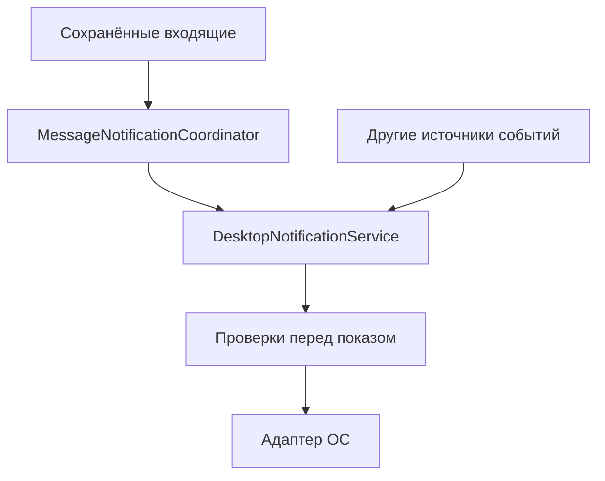
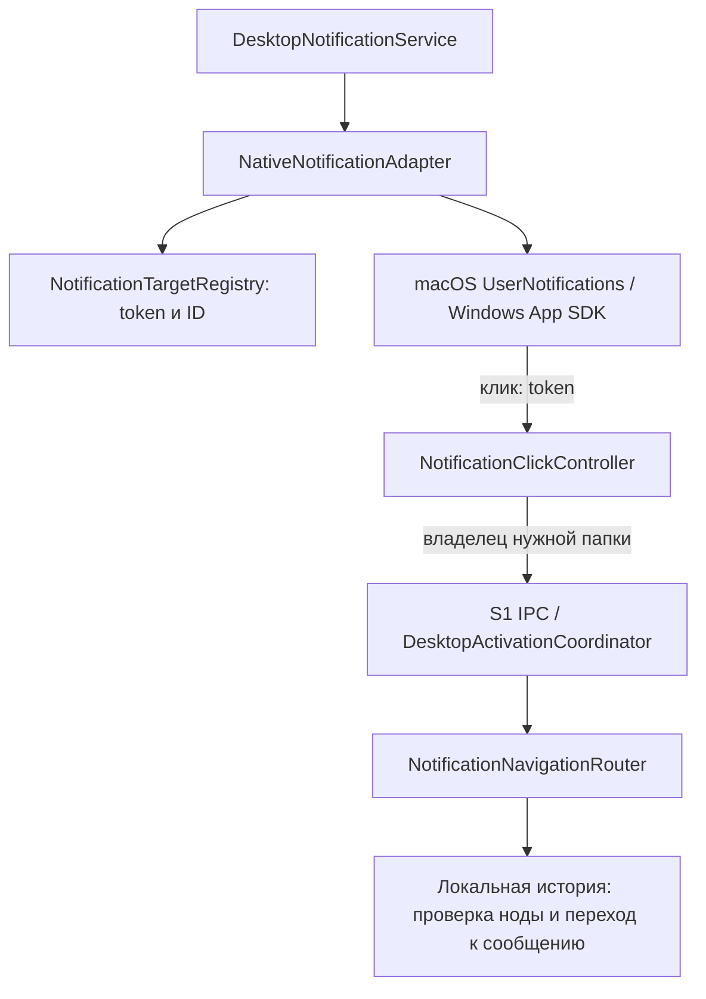

Архитектура получилась такой:

- **`MessageNotificationCoordinator`** принимает post-commit события, исключает распознанные дубликаты, объединяет близкие сообщения и готовит сводки начальной синхронизации и перегрузки.
- **`DesktopNotificationService`** — общий сервис для любых источников. Принимает запросы, хранит ограниченную очередь, заменяет ожидающие запросы по ключу и вызывает адаптер. Он не знает о SQLite, переписках или подключении.
- **`MessageNotificationPolicy`** выполняет проверки сообщений непосредственно перед показом: перечитывает сохранённый текст, проверяет checkbox и фактическую видимость через `DesktopNotificationVisibility`. Запросы других событий проходят без правил сообщений.
- **`IDesktopNotificationAdapter`** отвечает за платформенный показ. В S6 зарегистрирован `NativeNotificationAdapter`, использующий платформенный интерфейс для macOS и Windows.

Запрос содержит заголовок, текст, необязательный ключ объединения и типизированную цель: открыть приложение либо конкретное сообщение по ID. Другой компонент сможет отправлять готовые уведомления напрямую в общий сервис.

При выходе очереди отменяются. Уведомления не меняют unread, не запускают подключение и не повторяются после перезапуска.

Проверки: Core **387/387**, Desktop **385/385** в Debug/Release; native macOS с fake adapter пройден. [Подробный отчёт](../../testing/s5-notification-policy.md).

Дополнение S6: `NativeNotificationAdapter` создаёт непрозрачные targets для ОС,
заменяет баннер группы и очищает собственные баннеры при выходе.
`IDesktopNotificationPlatform` реализуют `MacOsNotificationPlatform`
(UserNotifications через native bridge) и `WindowsNotificationPlatform`
(Windows App SDK). Linux пока без показа.

Реестр нужен для разрешения ID после запуска процесса ОС; он не хранит текст
уведомления или секреты. Клик проходит через общий показ окна S1, затем UI-навигацию.
При другой ноде или удалённом сообщении окно открывается с пояснением.
Проверки платформенных разрешений не меняют checkbox предпочтений.
Базовая работа уведомлений macOS/Windows подтверждена пользователем; расширенная матрица S7 остаётся отдельной проверкой:
[отчёт S6](../../testing/s6-native-notifications.md).
