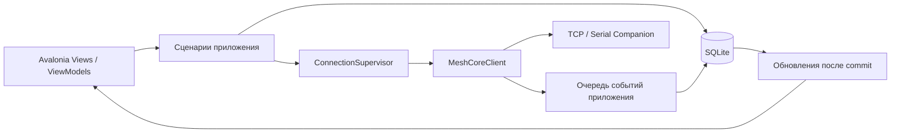

# 2. Технологии и структура решения

[Оглавление](../../MESSENGER_ARCHITECTURE.md) · [Маршрутизация чтения](../../README.md)

## 2. Технологии и структура решения

- `.NET 10`, как у существующей библиотеки.
- Avalonia Desktop + XAML, MVVM, `CommunityToolkit.Mvvm`.
- Базовая тема Fluent, собственные стили списков и сообщений, системная/светлая/тёмная тема.
- `Microsoft.Data.Sqlite`, параметризованный SQL, явные SQL-миграции.
- `Microsoft.Extensions.DependencyInjection` и `ILogger` в приложении.
- Без EF Core, ReactiveUI, MediatR и сервера в первой версии: требуемых механизмов немного.
- Версии NuGet фиксировать при первом этапе после проверки совместимости с `net10.0`;
  использовать стабильные версии и lock-файл, не плавающие диапазоны.

Подэтап A1 зафиксировал SDK `10.0.301` и следующие прямые зависимости:

| Назначение | Пакет | Версия |
| --- | --- | --- |
| Desktop UI | `Avalonia`, `Avalonia.Desktop`, `Avalonia.Themes.Fluent` | `12.1.3` |
| MVVM | `CommunityToolkit.Mvvm` | `8.4.2` |
| Будущее SQLite-хранилище Core | `Microsoft.Data.Sqlite` | `10.0.12` |
| Bootstrap | `Microsoft.Extensions.DependencyInjection`, `Microsoft.Extensions.Logging.Console` | `10.0.12` |
| Новые тесты | `xunit.v3` с Microsoft Testing Platform | `4.0.1` |

Версии централизованы в `Directory.Packages.props`; `Directory.Build.props`
включает NuGet lock-файлы, а CI должен восстанавливать их в locked mode.

Avalonia имеет desktop-поддержку Windows/macOS/Linux; минимальные версии ОС
зависят от выбранного релиза, поэтому матрицу пакетов и ОС нужно зафиксировать
при создании приложения. [Официальная матрица](https://docs.avaloniaui.net/docs/supported-platforms).
MVVM Toolkit не привязан к конкретному UI-фреймворку.
[Документация](https://learn.microsoft.com/en-us/dotnet/communitytoolkit/mvvm/).

```text
src/MeshCoreSharp/                  существующая единственная Companion-библиотека
src/MeshCoreMessenger.Core/         сценарии приложения и SQLite, без Avalonia
  Domain/                          идентичность, модели истории, статусы
  Application/                     сессия, сообщения, справочники, настройки
  Persistence/                     SQL, миграции, репозитории, резервные копии
  Integration/                     адаптер публичного MeshCoreClient
src/MeshCoreMessenger.Desktop/      Avalonia executable
  Views/ ViewModels/ Styles/ Assets/
  Platform/                        пути данных, Serial-порты, UI dispatcher
tests/MeshCoreMessenger.Core.Tests/
tests/MeshCoreMessenger.Desktop.Tests/
```

Эти четыре проекта и минимальный Avalonia shell созданы в A1; хранилище, приём и
connection lifecycle реализованы в A/B. Описанные ниже сценарии чтения Stage C,
отправки Stage D и последующие улучшения остаются проектом до соответствующих этапов.

Зависимости: `Desktop -> Core -> MeshCoreSharp`, а Desktop также может использовать
публичные модели библиотеки. Core содержит только логику приложения. Протокол,
кодировщики, маршрутизация и транспорты остаются в `MeshCoreSharp.dll`; новую
Companion-библиотеку создавать нельзя. В Core достаточно папок, отдельные проекты
для Domain/Infrastructure/Storage на этом этапе не нужны.


