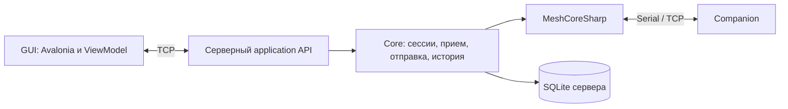

# Отложенная идея: самостоятельный сервер и удаленный GUI

Дата обсуждения: **07.10.2026**.

[План Messenger](../../MESSENGER_PLAN.md) · [Отложенные возможности](stage-f.md) · [Архитектурный аудит](../../ARCHITECTURE_REVIEW_2026-10-07.md)

## Статус и намерение пользователя

Пользователь рассматривает возможное разделение приложения на самостоятельную
серверную часть и графический клиент, но **не в ближайшее время**. Эта запись
сохраняет оценку и проектные соображения. Она не запускает реализацию, не меняет
приоритеты текущей итерации и не фиксирует сетевой протокол или сроки.

Сервер — полнофункциональное консольное Linux-приложение: самостоятельно работает
с Companion, принимает и сохраняет сообщения, выполняет отправки, управляет ACK,
повторами, справочником и конфигурацией. GUI — графический терминал, подключенный
к серверу по TCP. Работа сервера не зависит от наличия подключенного GUI.

## Оценка текущей готовности

Фундамент подходит: `MeshCoreMessenger.Core` и `MeshCoreSharp` не зависят от Avalonia.
Протокол, SQLite, прием, reconnect и delivery workflows уже отделены от Views.
Переписывать эти механизмы для серверного режима не требуется.

Основные препятствия находятся в application integration:

- `Desktop/Bootstrap/AppBootstrap.cs` собирает backend и UI в одном composition root.
- `DesktopConnectionLifecycle` и `DesktopShutdownCoordinator` связывают запуск и
  durable barriers с жизненным циклом окна.
- ViewModel используют несколько readers/stores/services напрямую; стабильного
  удаленного application API пока нет.
- `MessageService` связывает отправку с `DraftCapture`, очисткой черновика и callback
  редактора, а идентификатор новой операции создает внутри сервиса.
- Владение command workflow включает caller cancellation; token сетевого запроса
  нельзя автоматически использовать как lifetime уже принятой сервером отправки.

Самостоятельный headless backend — доработка умеренной сложности. Полноценный
удаленный GUI с надежным reconnect — средняя/высокая сложность. Несколько терминалов
добавляют отдельную сложность совместного состояния. Это оценка по текущему коду,
а не календарный план или обязательство по срокам. Linux/Serial и service lifecycle
потребуют собственной приемки.

## Предлагаемая граница

| Сервер | GUI |
| --- | --- |
| Подключение к ноде, reconnect, initial drain | Подключение к серверу и отображение состояния |
| Прием, сохранение, дедупликация сообщений | История, paging, поиск и отображение результатов |
| Проверка адресата, durable admission и отправка | Редактор и запрос отправки |
| ACK, повторы, маршруты и delivery state | Отображение прогресса и результатов |
| Изменение конфигурации ноды и readback | Формы и подтверждение действий |
| SQLite, миграции, backup, recovery | Тема, окно, прокрутка, вкладка |
| Устойчивые курсоры прочтения | Сообщение о фактически просмотренном диапазоне |

GUI не открывает серверную БД и не владеет Companion-сессией. Поиск выполняется
сервером над его историей; клиент управляет запросом и представлением результатов.
Редактор и несохраненный текст принадлежат клиенту. Черновики могут сохраняться
сервером; общность черновиков и read state между терминалами требует отдельного
решения, особенно при появлении нескольких пользователей.

Сервер остается единственным владельцем собственной активной Companion-сессии.
Несколько GUI и несколько одновременно активных нод — разные расширения; второе
не следует автоматически включать в scope первого.

## Что понадобится выделить при возвращении к идее

1. **Общий backend composition и lifecycle.** Отделить регистрации application
   services от UI. Выделить запуск supervisor, quiesce и durable shutdown без
   зависимости от окна. Для консольного хоста подходит .NET Generic Host; при
   сетевом API допустим ASP.NET Core host. Платформенные paths/instance lock/Serial
   adapters предоставить серверу отдельно. Из UI shutdown оставить остановку
   клиентских задач и сохранение UI preferences.
2. **Самостоятельный send use case.** Принимать immutable текст/адресата/параметры
   и operation identity. Сохранение и перенос черновика оформить явным сценарием,
   доступным также локальному Desktop. Callback редактора не входит в wire API.
3. **Небольшие application contracts.** Запросы истории/справочника/состояния,
   отправка, mutations, прочтение и subscriptions. Сначала возможна локальная
   реализация, затем remote adapter. Не проксировать автоматически каждый store,
   command lease и внутренний runtime object.
4. **Отдельные post-commit subscriptions.** Сервер рассылает готовые уведомления
   клиентам. Основной session event channel остается у единственного receive
   consumer. У каждого сетевого клиента собственный ограниченный буфер.
5. **Headless и сетевые проверки.** Прием/отправка без GUI, разрыв клиента при
   активной операции, повтор запроса после потери ответа, snapshot/subscription
   race, медленный клиент, перезапуск сервера и штатное завершение Linux-процесса.

Существующие протокольные инварианты, SQL ownership checks и barriers сохраняются.
Companion-библиотека остается одной `MeshCoreSharp.dll`; дополнительные server/API
проекты не должны копировать protocol/runtime. Application facade можно сначала
выделить внутри Core, без преждевременного дробления на новые библиотеки.

## Семантика сети важнее выбора транспорта

### Принятая операция принадлежит серверу

После durable acceptance отключение GUI не отменяет принятую отправку, ожидание
ACK или настроенный цикл попыток. Token ожидания RPC и lifetime серверной операции
разделяются. Отмена операции, если она предусмотрена, — отдельный application
запрос с проверкой состояния; уже выполненную радиопередачу отменить нельзя.

### Повтор запроса не создает повторную радиопередачу

Клиент передает устойчивый `OperationId`. Если ответ потерян, запрос с тем же ID
возвращает существующее состояние. Использование того же ID с другим содержимым
отклоняется. В persistence уже есть operation identity и проверки ownership, но
нынешний `MessageService` создает новый GUID внутри вызова: понадобится изменить
admission contract и обеспечить дедупликацию на уровне целого application workflow.

«Сервер принял операцию», «нода приняла команду» и «получен ACK» — разные статусы.
Перезапуск сервера сохраняет существующую recovery policy незавершенных отправок;
сам по себе сетевой reconnect не разрешает replay.

### GUI восстанавливает состояние после reconnect

Уведомления ускоряют UI, но источником истины остаются серверные сохраненные данные.
Нужен согласованный snapshot/subscription contract, исключающий пропуск изменений
между чтением snapshot и подпиской. Возможны revision/cursor и replay либо полная
resync после разрыва; выбор зависит от scope. `Messages.LocalSequence` не является
общим номером всех изменений: delivery status и directory updates могут меняться
без вставки нового сообщения.

### Медленный клиент не останавливает прием ноды

Переполнение клиентской очереди означает resync/disconnect данного терминала,
а не блокировку RX/SQLite. Сообщения уже сохранены сервером. Diagnostic stream
имеет отдельные правила потерь и ограничения. Серверный overload приема остается
самостоятельной задачей, указанной в архитектурном аудите.

### Несколько терминалов требуют явного ownership

Определить область черновиков, navigation preferences, прочтения и полномочий
изменения конфигурации. Mutations сериализуются сервером; stale session/binding
captures отклоняются. Доступ к управлению сервером и защита соединения должны
входить в будущий сетевой contract при доступе за пределами локального процесса.

## Кандидаты сетевого протокола

Для C# GUI и .NET сервера разумный кандидат — **gRPC**: команды/read API обычными
вызовами, уведомления через server streaming, HTTP/2 поверх TCP. Альтернатива —
WebSocket с собственными application messages. Собственный raw TCP тоже возможен,
но потребует framing, correlation, версионирования, errors и subscription semantics.
Протокол окончательно не выбран. Companion wire protocol не используется как
протокол GUI ↔ сервер.

Официальные справочные материалы:

- [.NET Generic Host](https://learn.microsoft.com/en-us/dotnet/core/extensions/generic-host).
- [gRPC services with ASP.NET Core](https://learn.microsoft.com/en-us/aspnet/core/grpc/aspnetcore?view=aspnetcore-10.0).

## Как учитывать идею сейчас

Не начинать server host, remote API или массовую переделку ViewModel только ради
этого возможного будущего. При обычных затрагивающих компонент рефакторингах полезно
сохранять UI-independent lifecycle, явный use-case boundary и серверное ownership
операций. Когда разделение станет текущей задачей, сначала уточнить single-user /
multi-terminal scope, затем последовательно выделить backend lifecycle, локальные
application contracts, headless host и сетевой adapter.
